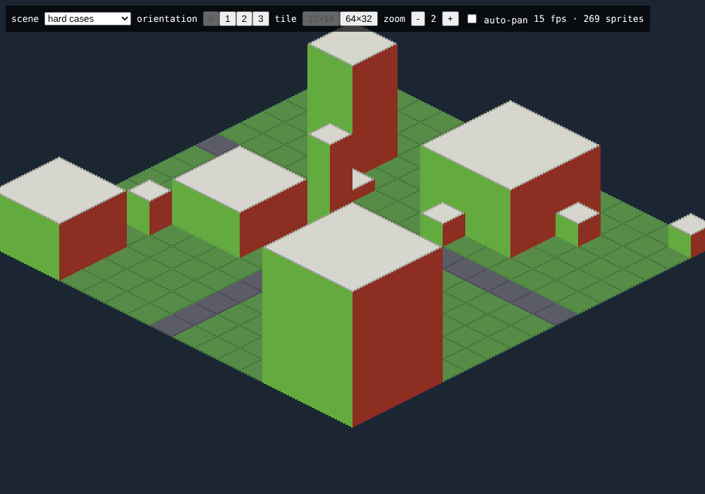
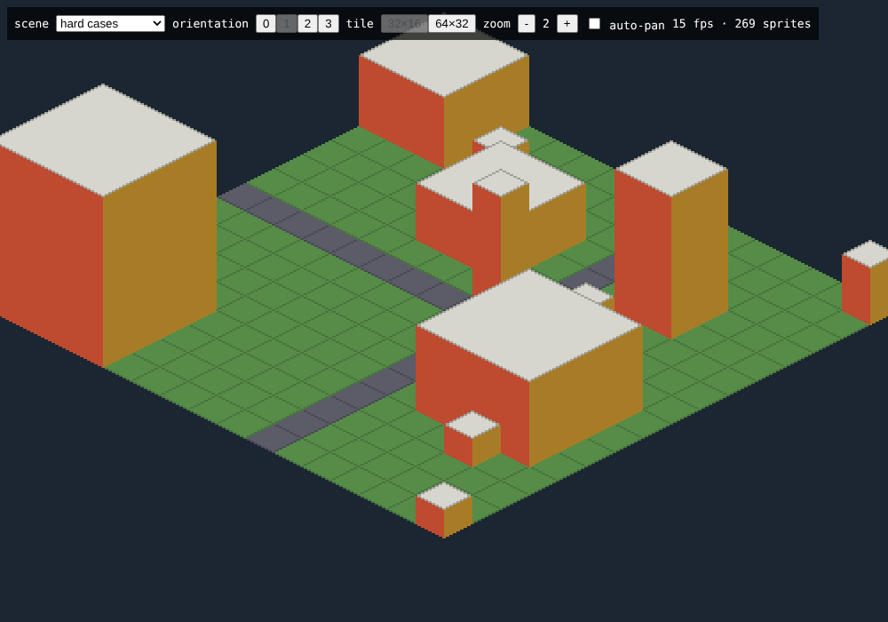
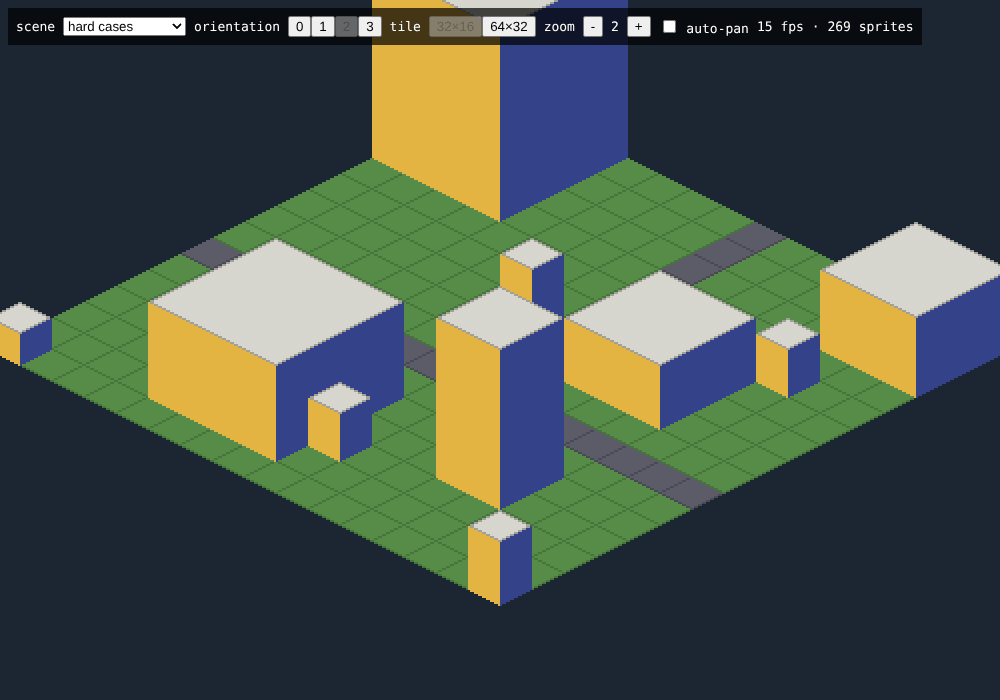
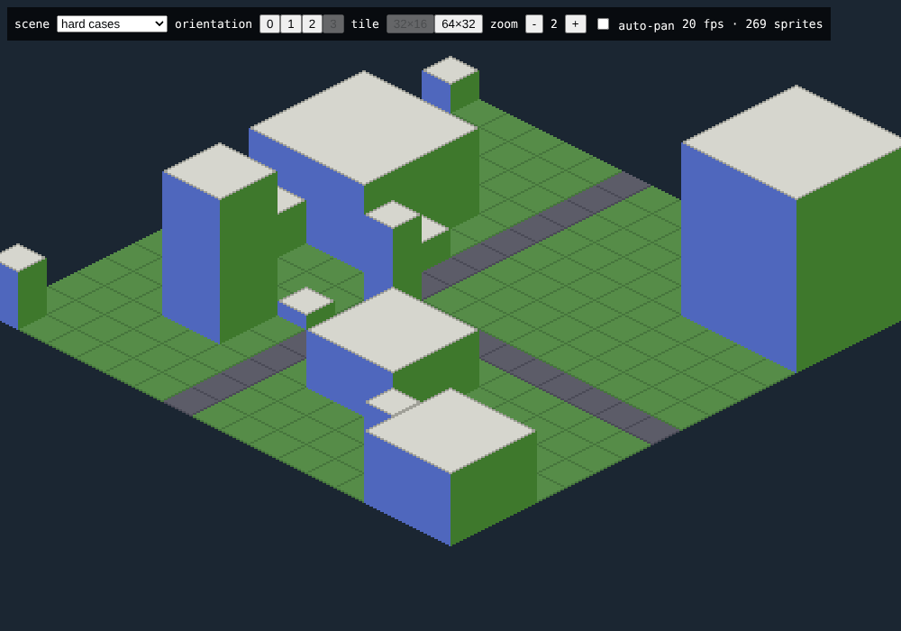
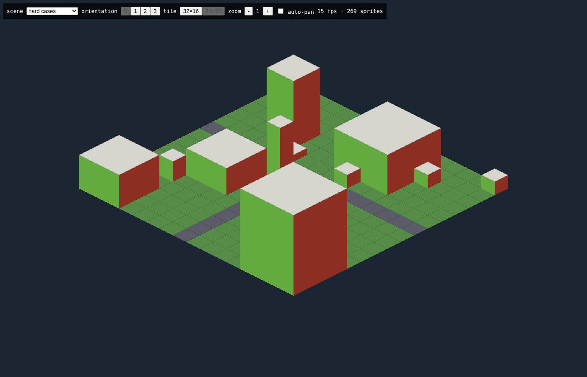
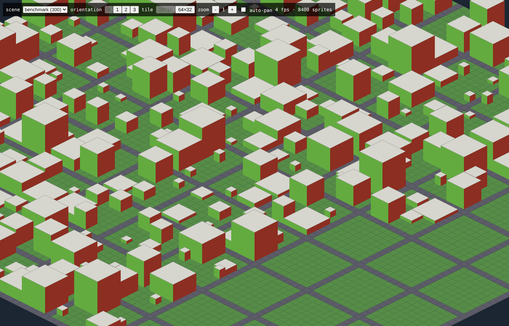

# Milestone 1.1 — Rendering spike results

Status: **done**, except the phone measurement, which is deferred to #10.

Run it with `pnpm dev` and open `/dev/spike`. Query parameters make a view reproducible: `scene=benchmark`, `o=0..3`, `tile=64`, `zoom=1..8`, `pan=1` (auto-pan for FPS measurements).

## Depth sorting in all four orientations

Hard-cases scene (`fixtures/spike/hard-cases.json`): a tall building behind a short one, small buildings against both walls of a large one, buildings touching a large one at both diagonal corners, and buildings on every map edge. Each world side has its own wall color (+x red, +y green, -x blue, -y yellow), so the colors must turn with the map.

| Orientation 0 | Orientation 1 |
|---|---|
|  |  |
| **Orientation 2** | **Orientation 3** |
|  |  |

No sorting errors found. **Confirmed.** The front-corner rule from the original proposal fails when a small building stands against a large one's wall, so the sort is now topological (see `ARCHITECTURE.md` §7.2 and `src/core/view/depth.ts`).

## Tile size

| 32 × 16 (zoom 2) | 64 × 32 (zoom 1) |
|---|---|
|  |  |

At the same on-screen size the two look identical with placeholders; the difference is how much detail an artist (or an AI image tool) can put into each tile, and how much art has to be drawn.

**Decision (2026-10-09): 32 × 16.** It keeps the art effort per building low, which matters while there is no dedicated artist, and matches the dense look of the reference. `ART_DIRECTION.md` is updated. The 64 × 32 switch stays in the spike page only.

## Benchmark

300 buildings on the lot grid plus 90 × 90 ground tiles (8,400 sprites, no culling or ground caching yet).

| Measurement | Result |
|---|---|
| Building the sorted render list (all 8,100 ground tiles and 300 buildings), Node 22 | 11–34 ms per orientation change |
| FPS while panning, desktop (RTX 2060, 1920 × 1080, DPR 1, Chrome 152, zoom 1, whole city on screen) | **179 fps** average, 175 fps in the slowest 5 % of frames, 1 of 1,794 frames below 55 fps |
| FPS while panning, phone | _deferred to #10_ |

The desktop GPU is stronger than the mid-range laptop in the target, so the phone result in #10 is the more telling one. The screenshots above come from headless Chromium with software WebGL (SwiftShader), which says nothing about real frame rates.

## Pixel integrity

The canvas is sized in device pixels and the zoom is a whole number of device pixels per art pixel, so pixels stay square on any display, including fractional device pixel ratios. The camera position is rounded to whole device pixels. Because zoom counts device pixels, zoom 2 on a 2× display is the same physical size as zoom 1 on a 1× display.
